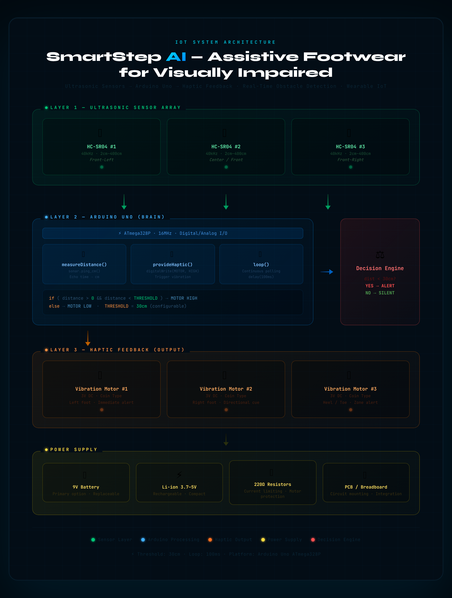

<div align="center">


[](https://git.io/typing-svg)

<br/>

[](https://www.arduino.cc/)
[]()
[]()
[]()

<br/>

[](LICENSE)
[]()
[]()
[]()

<br/>

> **👟 An IoT-powered wearable assistive system — ultrasonic sensors detect obstacles in real-time and vibration motors deliver instant haptic feedback, enabling safer independent mobility for visually impaired individuals.**

<br/>

[⚙️ Working Principle](#️-working-principle) &nbsp;•&nbsp; [🔧 Hardware](#-hardware-components) &nbsp;•&nbsp; [🏗️ Architecture](#%EF%B8%8F-system-architecture) &nbsp;•&nbsp; [💻 Code](#-software--code) &nbsp;•&nbsp; [👥 Team](#-team) &nbsp;•&nbsp; [☕ Support](#-support-the-project)

</div>

---

<div align="center">

## 🏆 Why SmartStep?

</div>

```
Traditional White Cane   →   Limited range, manual operation, no advance warning, hand-dependent
SmartStep IoT Footwear   →   Hands-free, real-time detection, instant haptic alert, wearable & compact
```

<table align="center">
<tr>
<td align="center" width="200">

<br/><b>Ultrasonic Detection</b>
<br/><sub>HC-SR04 sensors detect obstacles up to 30cm with sound-wave echo technology</sub>
</td>
<td align="center" width="200">

<br/><b>Haptic Feedback</b>
<br/><sub>Instant vibration motor alerts — no sound, no screen, no hands required</sub>
</td>
<td align="center" width="200">

<br/><b>Arduino Powered</b>
<br/><sub>ATmega328P microcontroller — reliable, low-power embedded processing</sub>
</td>
<td align="center" width="200">

<br/><b>Wearable Design</b>
<br/><sub>Compact, lightweight — integrates seamlessly into standard footwear</sub>
</td>
</tr>
</table>

---

## 🌟 Project Overview

**SmartStep** is an IoT-based assistive wearable system developed as a Final Year Diploma Project at **T.S. Srinivasan Polytechnic College**, Department of Mechatronics. It addresses a real accessibility gap: traditional white canes cannot detect obstacles at foot-level or warn in advance. SmartStep embeds ultrasonic sensors directly into footwear, enabling hands-free, real-time obstacle awareness through vibration feedback.

> 🎓 **Institution:** T.S. Srinivasan Polytechnic College, Vanagaram, Chennai — 600095
> 🏛️ **Department:** Mechatronics Engineering
> 👨‍🏫 **Project Guide:** Mrs. S.P. Chitra, Head of Department
> 📅 **Year:** Final Year Diploma Project, 2022

### 🎯 Problem Statement

Visually impaired individuals navigate daily environments with significant risk from ground-level and mid-height obstacles that traditional white canes frequently miss. There is a clear need for a **hands-free**, **always-on**, **wearable** solution that provides instant, intuitive alerts without interrupting natural walking motion.

**SmartStep solves this** by placing ultrasonic sensors in the footwear itself — detecting obstacles in the path of movement and alerting the user through vibration before contact occurs.

---

## ✨ Feature Highlights

<details>
<summary><b>📡 Real-Time Obstacle Detection</b></summary>

- HC-SR04 ultrasonic sensors continuously emit 40kHz sound pulses
- Echo reception time mathematically converts to precise distance measurement
- Multiple sensors (2–3) cover different angles — front, sides, foot-level
- Detection threshold configurable (default: < 30cm triggers alert)
- Continuous polling loop — no gaps in coverage during walking

</details>

<details>
<summary><b>🫳 Haptic Feedback System</b></summary>

- 3V DC vibration motors deliver instant tactile alerts
- No sound output — discreet and socially non-intrusive
- No visual display needed — pure tactile communication
- Activates within milliseconds of obstacle detection
- Motor pattern can be tuned for distance urgency

</details>

<details>
<summary><b>🤖 Arduino Embedded Control</b></summary>

- ATmega328P microcontroller — proven, reliable embedded platform
- `NewPing.h` library for precision ultrasonic timing
- Simple, readable C/C++ codebase
- Configurable threshold distances via constant definitions
- Loop-based architecture — always measuring, always ready

</details>

<details>
<summary><b>👟 Wearable Integration</b></summary>

- All components sized for footwear integration
- Lightweight 9V battery / Li-ion power supply
- Low-power consumption — extended wear time
- No external device or smartphone required
- Fits any standard shoe platform

</details>

<details>
<summary><b>🔮 Future IoT Roadmap</b></summary>

- GPS + cloud connectivity for real-time location tracking
- Mobile companion app for emergency alerts
- Voice/audio feedback via TWS earbuds
- AI/ML adaptive learning for walking pattern recognition
- Solar charging for extended battery life

</details>

---

## 🏗️ System Architecture

<div align="center">



*System architecture overview: Ultrasonic sensors embedded in footwear continuously measure distance → Arduino processes readings → Vibration motors provide instant haptic feedback → User detects obstacles in real-time*

</div>

### 🧩 Component Roles

| Component | Model | Role |
|-----------|-------|------|
| **Microcontroller** | Arduino Uno (ATmega328P) | Central brain — reads sensors, triggers motors |
| **Ultrasonic Sensors** | HC-SR04 | Distance measurement via sound-wave echo |
| **Vibration Motors** | 3V DC | Haptic feedback delivery to user |
| **Power Supply** | 9V Battery / Li-ion | System power — portable, wearable |
| **Resistors** | 220Ω | Current limiting for motor control |
| **PCB / Breadboard** | Custom | Component mounting and wiring |

---

## ⚙️ Working Principle

### Detection Logic Flow

```
POWER ON
    │
    ▼
Initialize Sensors & Motors
    │
    ▼
┌─────────────────────────────────┐
│   Ultrasonic Sensor Loop        │  ← Runs continuously
│   Emit 40kHz sound pulse        │
│   Measure echo return time      │
│   Calculate distance (cm)       │
└─────────────────┬───────────────┘
                  │
         ┌────────▼────────┐
         │ Distance < 30cm? │
         └────────┬────────┘
                  │
        ┌─────────┴──────────┐
        │                    │
       YES                   NO
        │                    │
        ▼                    ▼
 Vibration Motor        No Alert
   ACTIVATED            Silent
        │                    │
        ▼                    ▼
  Delay 100ms          Delay 100ms
        │                    │
        └─────────┬──────────┘
                  │
                  ▼
          Next Measurement
```

### Step-by-Step

1. **Ultrasonic sensors** continuously emit 40kHz sound pulses
2. **Echo reception** time is measured and converted to distance
3. **Arduino processes** sensor data in real-time loop
4. **Threshold check** — if obstacle within 30cm, trigger alert
5. **Vibration motors** activate immediately for haptic feedback
6. **User receives** tactile warning before physical contact

---

## 🔧 Hardware Components

| Component | Specification | Qty | Purpose |
|-----------|--------------|-----|---------|
| **Arduino Uno** | ATmega328P, 16MHz | 1 | Main controller |
| **Ultrasonic Sensor** | HC-SR04, 2cm–400cm range | 2–3 | Obstacle detection |
| **Vibration Motor** | 3V DC, coin-type | 2–3 | Haptic feedback |
| **Power Supply** | 9V Battery or Li-ion 3.7V | 1 | Portable power |
| **Resistors** | 220Ω | 3 | Current limiting |
| **Jumper Wires** | M-M, M-F | Set | Circuit connections |
| **Breadboard / PCB** | Standard / Custom | 1 | Circuit assembly |
| **Footwear Base** | Any standard shoe | 1 | Integration platform |

---

## 💻 Software & Code

### Environment

| Tool | Version |
|------|---------|
| Arduino IDE | 1.8.x or later |
| Language | C / C++ (Arduino dialect) |
| Library | `NewPing.h` — precision ultrasonic control |

### Core Code Structure

```cpp
#include <NewPing.h>

#define TRIGGER_PIN  9
#define ECHO_PIN     10
#define MAX_DISTANCE 200
#define THRESHOLD    30    // Alert if obstacle within 30cm
#define MOTOR_PIN    6

NewPing sonar(TRIGGER_PIN, ECHO_PIN, MAX_DISTANCE);

void setup() {
  pinMode(MOTOR_PIN, OUTPUT);
  Serial.begin(9600);
}

void loop() {
  measureDistance();
  delay(100);
}

void measureDistance() {
  int distance = sonar.ping_cm();

  if (distance > 0 && distance < THRESHOLD) {
    provideHapticFeedback();
  } else {
    digitalWrite(MOTOR_PIN, LOW);
  }
}

void provideHapticFeedback() {
  digitalWrite(MOTOR_PIN, HIGH);
  Serial.print("Obstacle detected: ");
  Serial.print(sonar.ping_cm());
  Serial.println(" cm");
}
```

📁 **Full Source Code:** [`Smart_Footwear_Assistive_Walking_System.ino`](Smart_Footwear_Assistive_Walking_System/Smart_Footwear_Assistive_Walking_System.ino)

---

## 📂 Project Structure

```plaintext
Design-And-Modelling-Of-Footwear-For-Visually-Impared/
│
├── 📁 Smart_Footwear_Assistive_Walking_System/
│   └── Smart_Footwear_Assistive_Walking_System.ino   # Main Arduino code
│
├── 📄 DESIGN AND MODELLING OF FOOTWEAR FOR VISUALLY IMPAIRED REPORT.pdf
├── 📄 DESIGN AND MODELLING OF FOOTWEAR FOR VISUALLY IMPAIRED REPORT.docx
├── 📄 DESIGN AND MODELLING OF FOOTWEAR FOR VISUALLY IMPAIRED REPORT.pptx
└── 📄 README.md
```

---

## 🛠️ Setup & Installation

### Prerequisites

```
✓ Arduino IDE 1.8.x or later
✓ NewPing library (install via Library Manager)
✓ Arduino Uno + USB cable
✓ Hardware components (see list above)
```

### Steps

**1. Install Arduino IDE**

Download from [arduino.cc/en/software](https://www.arduino.cc/en/software)

**2. Install NewPing Library**

```
Arduino IDE → Tools → Manage Libraries → Search "NewPing" → Install
```

**3. Clone the Repository**

```bash
git clone https://github.com/Darkwebnew/DESIGN-AND-MODELLING-OF-FOOTWEAR-FOR-VISUALLY-IMPAIRED.git
```

**4. Open the Sketch**

```
File → Open → Smart_Footwear_Assistive_Walking_System.ino
```

**5. Upload to Arduino**

```
Select Board: Arduino Uno
Select Port: COMx (Windows) or /dev/ttyUSBx (Linux)
Click Upload (→)
```

**6. Test**

```
Open Serial Monitor (9600 baud)
Move hand toward sensor — vibration motor should activate at <30cm
```

---

## 📚 Documentation

| Document | Link |
|----------|------|
| 📕 Full Project Report (PDF) | [View Report](DESIGN%20AND%20MODELLING%20OF%20FOOTWEAR%20FOR%20VISUALLY%20IMPAIRED%20REPORT%20.pdf) |
| 📘 Project Report (DOCX) | [View DOCX](DESIGN%20AND%20MODELLING%20OF%20FOOTWEAR%20FOR%20VISUALLY%20IMPAIRED%20REPORT%20.docx) |
| 🎞️ Presentation Slides | [View PPT](DESIGN%20AND%20MODELLING%20OF%20FOOTWEAR%20FOR%20VISUALLY%20IMPAIRED%20REPORT.pptx) |
| 💻 Arduino Source Code | [View Code](Smart_Footwear_Assistive_Walking_System/Smart_Footwear_Assistive_Walking_System.ino) |

---

## 🔮 Future Enhancements

| Enhancement | Description | Priority |
|------------|-------------|----------|
| 🌐 **GPS + IoT** | Real-time location tracking with cloud connectivity | High |
| 📱 **Mobile App** | Companion app for emergency alerts and configuration | High |
| 🗣️ **Voice Feedback** | Audio directions via TWS earbuds | Medium |
| 🤖 **AI/ML** | Adaptive learning for different walking patterns | Medium |
| 🔋 **Solar Charging** | Extended battery life with solar panel integration | Low |
| 🌧️ **Waterproofing** | All-weather durability for outdoor use | High |
| 📳 **Distance Scaling** | Variable vibration intensity based on obstacle proximity | Medium |

---

## 👥 Team

<div align="center">

### 🏆 Project Team — T.S. Srinivasan Polytechnic College

<table>
<tr>

<td align="center" width="200">
<a href="https://github.com/darkwebnew">

</a>
<br/><br/>
<b>V. Sriram</b>
<br/>
<sub>🚀 Team Lead & Hardware Design</sub>
<br/>
<sub>Roll No: 20700398</sub>
<br/><br/>
<a href="https://github.com/darkwebnew">

</a>
</td>

<td align="center" width="200">

<br/><br/>
<b>R. Siranjeevee</b>
<br/>
<sub>⚙️ Embedded Systems</sub>
<br/>
<sub>Roll No: 20700397</sub>
<br/><br/>

</td>

<td align="center" width="200">

<br/><br/>
<b>G. Varun</b>
<br/>
<sub>🔌 Circuit Integration</sub>
<br/>
<sub>Roll No: 20700400</sub>
<br/><br/>

</td>

</tr>
<tr>

<td align="center" width="200">

<br/><br/>
<b>J. C. Kuber</b>
<br/>
<sub>💻 Code Development</sub>
<br/>
<sub>Roll No: 20700373</sub>
<br/><br/>

</td>

<td align="center" width="200">

<br/><br/>
<b>V. Venkat Charan</b>
<br/>
<sub>🧪 Testing & Validation</sub>
<br/>
<sub>Roll No: 20700401</sub>
<br/><br/>

</td>

<td align="center" width="200">

<br/><br/>
<b>G.K. Yashwantha Sai</b>
<br/>
<sub>📚 Documentation</sub>
<br/>
<sub>Roll No: 20700406</sub>
<br/><br/>

</td>

</tr>
</table>

<br/>

### 🎓 Academic Guidance

| Role | Name | Department |
|------|------|-----------|
| Project Guide & HOD | **Mrs. S.P. Chitra** | Mechatronics Engineering |
| Institution | **T.S. Srinivasan Polytechnic College** | Vanagaram, Chennai — 600095 |

</div>

---

## 🤝 Contributing

> ⚠️ **Important:** This project is under a restrictive proprietary license. Contributions are welcome strictly for **educational improvement purposes only.** By submitting a pull request, you agree your contribution becomes part of this project under the same license terms. No contributor may independently commercialize any part of this code or hardware design.

### How to Contribute

1. **Open an Issue** — discuss your idea before coding
2. **Fork** the repository
3. **Create a branch** — `git checkout -b feature/YourFeature`
4. **Commit** — `git commit -m 'feat: Add YourFeature'`
5. **Push & open a Pull Request**

### Contribution Areas

| Area | Difficulty | Skills Needed |
|------|-----------|--------------|
| 🌐 IoT / GPS Integration | Advanced | Arduino, ESP32, MQTT |
| 📱 Mobile App | Medium | React Native / Flutter |
| 🗣️ Voice Feedback | Medium | Arduino, audio modules |
| 🤖 ML Obstacle Learning | Advanced | Python, TensorFlow Lite |
| 📚 Documentation | Beginner | Markdown |
| 🧪 Hardware Testing | Medium | Electronics, multimeter |

---

## ☕ Support the Project

<div align="center">

**If SmartStep inspired your research or assistive tech project — consider supporting continued development!**

<br/>

<a href="https://www.buymeacoffee.com/sriramnvks" target="_blank">

</a>

<br/><br/>

*Your support helps build better assistive technology for communities that need it.*

<br/>

[](https://github.com/sponsors/darkwebnew)
[](https://paypal.me/sriramnvks)

</div>

---

## 📄 License

<div align="center">

```
╔══════════════════════════════════════════════════════════════════╗
║              PROPRIETARY SOFTWARE LICENSE                        ║
║      Copyright (c) 2022  V. Sriram & SmartStep Project Team     ║
║                   All Rights Reserved                            ║
╚══════════════════════════════════════════════════════════════════╝
```

</div>

**This software, hardware design, circuit schematics, documentation, and all associated assets are the exclusive intellectual property of the authors and are protected under applicable copyright law and the Indian Copyright Act, 1957.**

### ❌ You MAY NOT:

- Copy, reproduce, or redistribute this code or hardware design in whole or in part
- Use this project in commercial products or services
- Modify or create derivative works without explicit written permission
- Present this work as your own in academic or professional contexts
- Deploy in any commercial assistive technology product without authorization

### ✅ You MAY:

- View and study the source code for **personal educational purposes only**
- Fork on GitHub **solely to submit pull requests**
- Reference this project in academic citations with proper attribution
- Use general concepts as inspiration for entirely original work

### ⚖️ Legal Notice

Any unauthorized use, reproduction, or commercial deployment is strictly prohibited and may result in civil and criminal penalties. The authors reserve all rights.

> Licensing inquiries: [@darkwebnew](https://github.com/darkwebnew) via GitHub Issues

---

## 🙏 Acknowledgments

<div align="center">

| Contribution | Name / Organization |
|-------------|---------------------|
| Project Guide | **Mrs. S.P. Chitra**, HOD, Dept. of Mechatronics |
| Institution | **T.S. Srinivasan Polytechnic College**, Chennai |
| Department | **Mechatronics Engineering** |
| Community | **Visually Impaired Community** — user feedback and validation |
| Open Source | **Arduino & NewPing library** contributors |
| Research | Assistive technology and IoT research community |

</div>

---

<div align="center">


**⭐ Star this repository if SmartStep helped your project!**

[](https://github.com/Darkwebnew/DESIGN-AND-MODELLING-OF-FOOTWEAR-FOR-VISUALLY-IMPAIRED/stargazers)
[](https://github.com/Darkwebnew/DESIGN-AND-MODELLING-OF-FOOTWEAR-FOR-VISUALLY-IMPAIRED/network/members)

<br/>

*Made with ❤️ for empowering independent mobility · T.S. Srinivasan Polytechnic College · Chennai, India 🇮🇳*

*Empowering Independence Through Technology*

[🐛 Report Bug](https://github.com/Darkwebnew/DESIGN-AND-MODELLING-OF-FOOTWEAR-FOR-VISUALLY-IMPAIRED/issues) · [💡 Request Feature](https://github.com/Darkwebnew/DESIGN-AND-MODELLING-OF-FOOTWEAR-FOR-VISUALLY-IMPAIRED/issues)

</div>
