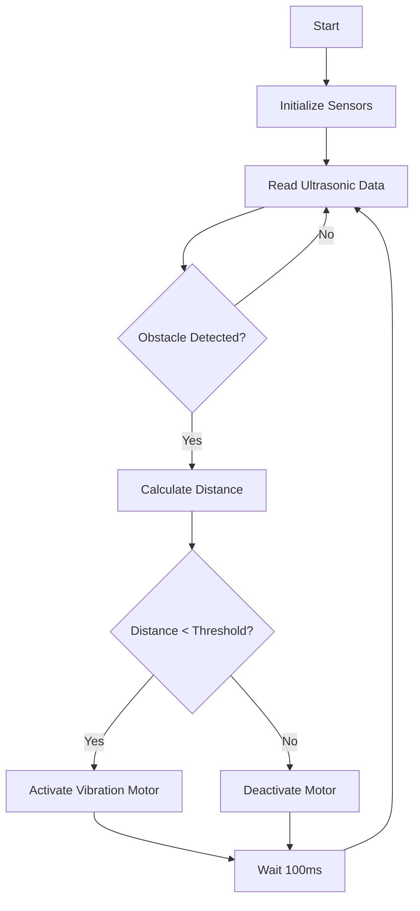

# Smart Footwear Assistive Walking System

> 
*An IoT-powered assistive device for visually impaired individuals using ultrasonic sensing and haptic feedback*

[](#)
[](#license)
[](#)
[](#)

---

## 📑 Table of Contents

- [🧠 Overview](#-overview)
- [🎯 Problem Statement](#-problem-statement)
- [⚙️ Working Principle](#️-working-principle)
- [🪫 Hardware Components](#-hardware-components)
- [💻 Software & Code](#-software--code)
- [🏗️ System Architecture](#️-system-architecture)
- [🔄 System Flow](#-system-flow)
- [👥 Team](#-team)
- [📂 Repository Structure](#-repository-structure)
- [🎓 Acknowledgments](#-acknowledgments)
- [📄 License](#-license)
- [🔗 Documentation Links](#-documentation-links)

---

## 🧠 Overview

**Smart Footwear Assistive Walking System** is an innovative IoT-based assistive technology designed to enhance mobility and safety for visually impaired individuals. The system integrates ultrasonic sensors, haptic feedback mechanisms, and intelligent processing to detect obstacles and provide real-time alerts during navigation.

This project combines **embedded systems**, **IoT connectivity**, and **assistive technology** to create an affordable, compact, and user-friendly solution that can be seamlessly integrated into everyday footwear.

### Key Highlights:

- ✅ Real-time obstacle detection using ultrasonic sensors
- ✅ Haptic feedback through vibration motors
- ✅ Arduino-based embedded control system
- ✅ Portable and wearable design
- ✅ Low-power consumption
- ✅ Scalable for future IoT enhancements

---

## 🎯 Problem Statement

Visually impaired individuals face significant challenges in detecting obstacles at ground level and mid-height during daily navigation. Traditional assistive devices like white canes have limitations:

- ⚠️ Limited detection range
- ⚠️ Cannot detect overhead obstacles
- ⚠️ Requires constant physical contact with surfaces
- ⚠️ Reactive rather than proactive warning system

Our project addresses these gaps by providing:

- ✅ Hands-free operation
- ✅ Proactive obstacle alerts
- ✅ Enhanced spatial awareness
- ✅ Comfortable and discreet wearable technology

---

## ⚙️ Working Principle

The Smart Footwear system operates on a simple yet effective principle:

1. **Detection**: Ultrasonic sensors (HC-SR04) mounted on the footwear emit ultrasonic waves
2. **Measurement**: Sensors calculate distance to obstacles based on echo return time
3. **Processing**: Arduino Nano processes distance data in real-time
4. **Alert**: When obstacles are within threshold distance, vibration motors activate
5. **Feedback**: User receives haptic feedback proportional to obstacle proximity

### Distance Thresholds:

```cpp
if (distance < 20 cm)  → Strong vibration
if (distance < 40 cm)  → Medium vibration
if (distance < 60 cm)  → Weak vibration
if (distance > 60 cm)  → No vibration
```

---

## 🪫 Hardware Components

### Core Components:

| Component | Specification | Quantity | Purpose |
|-----------|--------------|----------|----------|
| **Arduino Nano** | ATmega328P, 5V | 1 | Main microcontroller |
| **HC-SR04** | Ultrasonic sensor | 2-4 | Obstacle detection |
| **Vibration Motor** | 3V DC | 2-4 | Haptic feedback |
| **Battery** | 9V / Li-ion 3.7V | 1 | Power supply |
| **Resistors** | 220Ω, 10kΩ | As needed | Current limiting |
| **Jumper Wires** | Male-to-Female | Multiple | Connections |
| **PCB/Breadboard** | - | 1 | Circuit assembly |

### Optional Components:

- **Buzzer**: Audio alerts for critical obstacles
- **LED Indicators**: Visual status indicators
- **Power Switch**: Manual on/off control
- **Voltage Regulator**: Stable 5V output

---

## 💻 Software & Code

### Programming Language:
- **C/C++** (Arduino IDE)

### Key Libraries:
```cpp
#include <NewPing.h>          // Enhanced ultrasonic sensor control
```

### Code Structure:

```cpp
// Pin Definitions
#define TRIG_PIN 9
#define ECHO_PIN 10
#define MOTOR_PIN 3

// Distance threshold
#define MAX_DISTANCE 200

// Main logic
void setup() {
  pinMode(TRIG_PIN, OUTPUT);
  pinMode(ECHO_PIN, INPUT);
  pinMode(MOTOR_PIN, OUTPUT);
}

void loop() {
  int distance = measureDistance();
  provideHapticFeedback(distance);
  delay(100);
}
```

### Uploading Code:

1. Download the Arduino IDE from [arduino.cc](https://www.arduino.cc)
2. Install required libraries (NewPing)
3. Connect Arduino Nano via USB
4. Select correct Board and Port
5. Upload the sketch

---

## 🏗️ System Architecture

```
┌─────────────────────────────────────────────────┐
│          Smart Footwear System                  │
├─────────────────────────────────────────────────┤
│                                                 │
│  ┌──────────────┐        ┌──────────────┐     │
│  │  Ultrasonic  │        │  Ultrasonic  │     │
│  │  Sensor (L)  │        │  Sensor (R)  │     │
│  └──────┬───────┘        └──────┬───────┘     │
│         │                       │             │
│         └───────────┬───────────┘             │
│                     │                         │
│              ┌──────▼──────┐                  │
│              │   Arduino   │                  │
│              │     Nano    │                  │
│              └──────┬──────┘                  │
│                     │                         │
│         ┌───────────┴───────────┐             │
│         │                       │             │
│  ┌──────▼───────┐        ┌──────▼───────┐    │
│  │  Vibration   │        │  Vibration   │    │
│  │  Motor (L)   │        │  Motor (R)   │    │
│  └──────────────┘        └──────────────┘    │
│                                               │
│              ┌──────────┐                     │
│              │  Battery │                     │
│              │   Pack   │                     │
│              └──────────┘                     │
└───────────────────────────────────────────────┘
```

---

## 🔄 System Flow



**Step-by-Step Process:**

1. 🟢 System powers on
2. 🔍 Sensors continuously scan environment
3. 📏 Distance measurements taken every 100ms
4. 🧮 Arduino processes data
5. ⚡ Vibration intensity calculated
6. 📳 Haptic feedback delivered
7. 🔄 Loop repeats

---

## 👥 Team

This project was developed by a dedicated team of students from Sri Sivasubramaniya Nadar College of Engineering:

* **V. Sriram** (20700398)
* **R. Siranjeevee** (20700397)
* **G. Varun** (20700400)
* **J. C. Kuber** (20700373)
* **V. Venkat Charan** (20700401)
* **Yashwantha Sai G.K** (20700406)

**Guide:** Mrs. S.P. Chitra (HOD, Dept. of Mechatronics)

---

## 📂 Repository Structure

```
DESIGN-AND-MODELLING-OF-FOOTWEAR-FOR-VISUALLY-IMPAIRED/
│
├── docs/
│   ├── DESIGN AND MODELLING OF FOOTWEAR FOR VISUALLY IMPAIRED REPORT.pdf
│   ├── DESIGN AND MODELLING OF FOOTWEAR FOR VISUALLY IMPAIRED REPORT.docx
│   └── Project_Presentation.pptx
│
├── src/
│   └── Smart_Footwear_Assistive_Walking_System.ino
│
├── README.md
└── LICENSE
```

---

## 🎓 Acknowledgments

We extend our sincere gratitude to:

* **Mrs. S.P. Chitra**, HOD, Department of Mechatronics, for her invaluable guidance and support throughout the project
* **Sri Sivasubramaniya Nadar College of Engineering** for providing resources and infrastructure
* **Department of Mechatronics** for their technical assistance
* The **visually impaired community** whose needs and feedback inspired this innovation
* All the **researchers and developers** in assistive technology whose work paved the way

---

## 📄 License

This project is licensed under the MIT License.

```
MIT License

Copyright (c) 2024 Team Smart Footwear

Permission is hereby granted, free of charge, to any person obtaining a copy
of this software and associated documentation files (the "Software"), to deal
in the Software without restriction, including without limitation the rights
to use, copy, modify, merge, publish, distribute, sublicense, and/or sell
copies of the Software, and to permit persons to whom the Software is
furnished to do so, subject to the following conditions:

The above copyright notice and this permission notice shall be included in all
copies or substantial portions of the Software.

THE SOFTWARE IS PROVIDED "AS IS", WITHOUT WARRANTY OF ANY KIND, EXPRESS OR
IMPLIED, INCLUDING BUT NOT LIMITED TO THE WARRANTIES OF MERCHANTABILITY,
FITNESS FOR A PARTICULAR PURPOSE AND NONINFRINGEMENT. IN NO EVENT SHALL THE
AUTHORS OR COPYRIGHT HOLDERS BE LIABLE FOR ANY CLAIM, DAMAGES OR OTHER
LIABILITY, WHETHER IN AN ACTION OF CONTRACT, TORT OR OTHERWISE, ARISING FROM,
OUT OF OR IN CONNECTION WITH THE SOFTWARE OR THE USE OR OTHER DEALINGS IN THE
SOFTWARE.
```

---

## 🔗 Documentation Links

### 📄 Project Reports:

- [📕 Full Project Report (PDF)](./docs/DESIGN%20AND%20MODELLING%20OF%20FOOTWEAR%20FOR%20VISUALLY%20IMPAIRED%20REPORT.pdf)
- [📘 Project Report (DOCX)](./docs/DESIGN%20AND%20MODELLING%20OF%20FOOTWEAR%20FOR%20VISUALLY%20IMPAIRED%20REPORT.docx)

### 📊 Presentation:

- [🎞️ Project Presentation (PPT)](./docs/Project_Presentation.pptx)

### 💻 Source Code:

- [⚙️ Main Arduino Code](./src/Smart_Footwear_Assistive_Walking_System.ino)

---

## 🌟 Future Enhancements

- 🌐 **IoT Integration**: Real-time location tracking via GPS and cloud connectivity
- 📱 **Mobile App**: Companion app for configuration and emergency alerts
- 🗣️ **Voice Feedback**: Audio directions using TTS (Text-to-Speech)
- 🤖 **AI/ML**: Adaptive learning for different walking patterns
- 🔋 **Solar Charging**: Extended battery life with solar panels
- 🌧️ **Weather Resistance**: Enhanced waterproofing for all conditions

---

## 📞 Contact

For queries, suggestions, or collaboration:

* V. Sriram (20700398)
* R. Siranjeevee (20700397)
* G. Varun (20700400)
* J. C. Kuber (20700373)
* V. Venkat Charan (20700401)
* Yashwantha Sai G.K (20700406)
* Guide: Mrs. S.P. Chitra (HOD, Dept. of Mechatronics)

---

<div align="center">

### ⭐ If you find this project helpful, please consider giving it a star!

**Made with ❤️ by Team Smart Footwear**

*Empowering Independence Through Technology*

</div>
