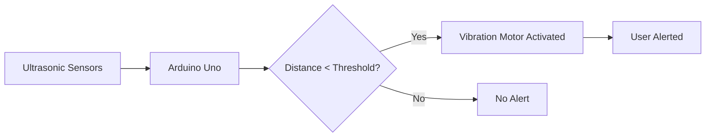
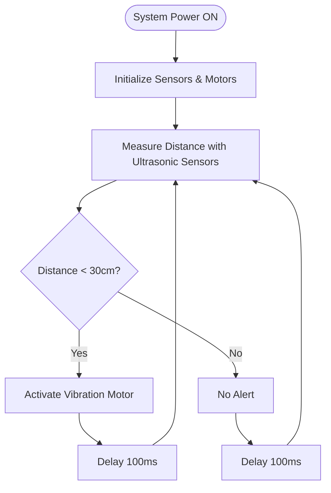

# Design And Modelling Of Footwear For Visually Impared
> 
*An IoT-powered assistive device for visually impaired individuals using ultrasonic sensing and haptic feedback*

[](#)
[](#license)
[](#)
[](#)

---

## 📑 Table of Contents

- [🧠 Overview](#-overview)
- [🎯 Problem Statement](#-problem-statement)
- [⚙️ Working Principle](#️-working-principle)
- [🪫 Hardware Components](#-hardware-components)
- [💻 Software & Code](#-software--code)
- [🏗️ System Architecture](#️-system-architecture)
- [🔄 System Flow](#-system-flow)
- [👥 Team](#-team)
- [📂 Repository Structure](#-repository-structure)
- [🎓 Acknowledgments](#-acknowledgments)
- [📄 License](#-license)
- [🔗 Documentation Links](#-documentation-links)

---

## 🧠 Overview

**Smart Footwear Assistive Walking System** is an innovative IoT-based assistive technology designed to enhance mobility and safety for visually impaired individuals. The system integrates ultrasonic sensors, haptic feedback mechanisms, and intelligent processing to detect obstacles and provide real-time alerts during navigation.

This project combines **embedded systems**, **IoT connectivity**, and **assistive technology** to create an affordable, compact, and user-friendly solution that can be seamlessly integrated into everyday footwear.

### Key Highlights:
- ✅ Real-time obstacle detection using ultrasonic sensors
- ✅ Haptic feedback through vibration motors
- ✅ Arduino-based embedded control system
- ✅ Portable and wearable design
- ✅ Low-power consumption
- ✅ Scalable for future IoT enhancements

---

## 🎯 Problem Statement

Visually impaired individuals face significant challenges in detecting obstacles at ground level and mid-height during daily navigation. Traditional assistive devices like white canes have limitations:

❌ Limited detection range  
❌ Cannot detect obstacles at foot level  
❌ Require constant hand movement  
❌ No advance warning system  

💡 **Our Solution**: A wearable, sensor-based footwear system that provides real-time obstacle detection with haptic feedback, enabling safer independent mobility.

---

## ⚙️ Working Principle



### Detection Logic:
1. **Ultrasonic sensors** continuously emit sound waves
2. **Echo reception** calculates distance to obstacles
3. **Arduino processes** the sensor data
4. **Vibration motors** activate when obstacle is within threshold (e.g., <30cm)
5. **User receives** immediate haptic feedback

---

## 🪫 Hardware Components

| Component | Specification | Quantity | Purpose |
|-----------|--------------|----------|----------|
| **Arduino Uno** | ATmega328P | 1 | Main controller |
| **Ultrasonic Sensors** | HC-SR04 | 2-3 | Obstacle detection |
| **Vibration Motors** | 3V DC | 2-3 | Haptic feedback |
| **Power Supply** | 9V Battery/Li-ion | 1 | System power |
| **Resistors** | 220Ω | 3 | Current limiting |
| **Jumper Wires** | - | Set | Connections |
| **Breadboard/PCB** | - | 1 | Circuit assembly |
| **Footwear Base** | Any shoe | 1 | Integration platform |

---

## 💻 Software & Code

### Programming Environment:
- **IDE**: Arduino IDE 1.8.x or later
- **Language**: C/C++ (Arduino)
- **Libraries**:
  - `NewPing.h` - Enhanced ultrasonic sensor control
  - Built-in Arduino libraries

### Key Functions:
```cpp
void setup() {
  // Initialize sensors and motors
}

void loop() {
  measureDistance();
  provideHapticFeedback();
}
```

📁 **Code Location**: [`Smart_Footwear_Assistive_Walking_System.ino`](https://github.com/Darkwebnew/DESIGN-AND-MODELLING-OF-FOOTWEAR-FOR-VISUALLY-IMPAIRED/blob/main/Smart_Footwear_Assistive_Walking_System/Smart_Footwear_Assistive_Walking_System.ino)

---

## 🏗️ System Architecture

```
┌─────────────────────────────────────────────────┐
│           Footwear Integration Layer            │
│  ┌─────────┐  ┌─────────┐  ┌─────────┐        │
│  │Sensor 1 │  │Sensor 2 │  │Sensor 3 │        │
│  └────┬────┘  └────┬────┘  └────┬────┘        │
│       │            │            │              │
│       └────────────┴────────────┘              │
│                    │                           │
│       ┌────────────▼────────────┐              │
│       │   Arduino Uno (Brain)   │              │
│       │   - Data Processing     │              │
│       │   - Decision Making     │              │
│       └────────────┬────────────┘              │
│                    │                           │
│       ┌────────────▼────────────┐              │
│       │  Vibration Motor Array  │              │
│       │   (Haptic Feedback)     │              │
│       └─────────────────────────┘              │
│                                                 │
│  Power: 9V Battery/Li-ion (3.7-5V)             │
└─────────────────────────────────────────────────┘
```

---

## 🔄 System Flow



---

## 👥 Team

### Project Contributors:

| Name | Role | Roll Number |
|------|------|-------------|
| **V. Sriram** | Team Lead & Hardware Design | 20700398 |
| **R. Siranjeevee** | Embedded Systems | 20700397 |
| **G. Varun** | Circuit Integration | 20700400 |
| **J. C. Kuber** | Code Development | 20700373 |
| **V. Venkat Charan** | Testing & Validation | 20700401 |
| **Yashwantha Sai G.K** | Documentation | 20700406 |

### Project Guide:
👨‍🏫 **Mrs. S.P. Chitra**  
Head of Department, Mechatronics  
T.S. Srinivasan Polytechnic College

---

## 📂 Repository Structure

```
DESIGN-AND-MODELLING-OF-FOOTWEAR-FOR-VISUALLY-IMPAIRED/
│
├── Smart_Footwear_Assistive_Walking_System/
│   └── Smart_Footwear_Assistive_Walking_System.ino  # Main Arduino code
│
├── DESIGN AND MODELLING OF FOOTWEAR FOR VISUALLY IMPAIRED REPORT.pdf
│   # Comprehensive project report
│
├── DESIGN AND MODELLING OF FOOTWEAR FOR VISUALLY IMPAIRED REPORT.docx
│   # Editable report document
│
├── DESIGN AND MODELLING OF FOOTWEAR FOR VISUALLY IMPAIRED REPORT.pptx
│   # Project presentation slides
│
└── README.md  # This file
```

---

## 🎓 Acknowledgments

We would like to express our sincere gratitude to:

• Mrs. S.P. Chitra, HOD, Department of Mechatronics, for her invaluable guidance and support throughout the project

• T.S. Srinivasan Polytechnic College, No.1, TVS School St, Vanagaram, Chennai, Tamil Nadu 600095, for providing resources, technical assistance, and encouragement for innovation

• Department of Mechatronics for their support

• The visually impaired community for their user feedback

• The open source and assistive tech research community whose work paved the way

This project was completed as part of the Final Year Diploma Project (2022).

---

## 📄 License

This project is licensed under the **MIT License** - see the LICENSE file for details.

```
MIT License - Free to use, modify, and distribute with attribution
```

---

## 🔗 Documentation Links

### 📚 Reports:
- [📕 Full Project Report (PDF)](https://github.com/Darkwebnew/DESIGN-AND-MODELLING-OF-FOOTWEAR-FOR-VISUALLY-IMPAIRED/blob/main/DESIGN%20AND%20MODELLING%20OF%20FOOTWEAR%20FOR%20VISUALLY%20IMPAIRED%20REPORT%20.pdf)
- [📘 Project Report (DOCX)](https://github.com/Darkwebnew/DESIGN-AND-MODELLING-OF-FOOTWEAR-FOR-VISUALLY-IMPAIRED/blob/main/DESIGN%20AND%20MODELLING%20OF%20FOOTWEAR%20FOR%20VISUALLY%20IMPAIRED%20REPORT%20.docx)

### 📊 Presentation:
- [🎞️ Project Presentation (PPT)](https://github.com/Darkwebnew/DESIGN-AND-MODELLING-OF-FOOTWEAR-FOR-VISUALLY-IMPAIRED/blob/main/DESIGN%20AND%20MODELLING%20OF%20FOOTWEAR%20FOR%20VISUALLY%20IMPAIRED%20REPORT.pptx)

### 💻 Source Code:
- [⚙️ Main Arduino Code](https://github.com/Darkwebnew/DESIGN-AND-MODELLING-OF-FOOTWEAR-FOR-VISUALLY-IMPAIRED/blob/main/Smart_Footwear_Assistive_Walking_System/Smart_Footwear_Assistive_Walking_System.ino)

---

## 🌟 Future Enhancements

- 🌐 **IoT Integration**: Real-time location tracking via GPS and cloud connectivity
- 📱 **Mobile App**: Companion app for configuration and emergency alerts
- 🗣️ **Voice Feedback**: Audio directions using TWS
- 🤖 **AI/ML**: Adaptive learning for different walking patterns
- 🔋 **Solar Charging**: Extended battery life with solar panels
- 🌧️ **Weather Resistance**: Enhanced waterproofing for all conditions

---

## 📞 Contact

For queries, suggestions, or collaboration:

* V. Sriram (20700398)
* R. Siranjeevee (20700397)
* G. Varun (20700400)
* J. C. Kuber (20700373)
* V. Venkat Charan (20700401)
* Yashwantha Sai G.K (20700406)
* Guide: Mrs. S.P. Chitra (HOD, Dept. of Mechatronics)

---

<div align="center">

### ⭐ If you find this project helpful, please consider giving it a star!

**Made with ❤️ by Team Smart Footwear**

*Empowering Independence Through Technology*

</div>
